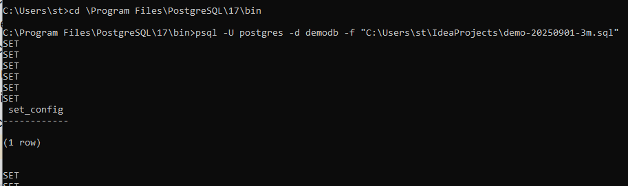

[Демонстрационная база данных](https://postgrespro.ru/education/demodb)

1. Скачать [demo-20250901-3m.sql.gz](https://edu.postgrespro.ru/demo-20250901-3m.sql.gz)
2. Распаковать данные при помощи psql*
3. Выполнить запросы из задания

--------------------------
🔹 Уровень 1: Базовые запросы (SELECT, WHERE, ORDER BY)

1. Выведите список всех аэропортов с их кодами (IATA), названиями и городами. Отсортируйте по названию города.
2. Найдите все рейсы, вылетающие из аэропорта «Домодедово» (код DME) в сентябре 2016 года.
3. Выведите модели всех самолётов, упорядоченные по дальности полёта (от большей к меньшей).
4. Сколько всего бронирований было совершено в октябре 2016 года?
5. Найдите все рейсы, прибывающие в аэропорт «Пулково» (код LED), с указанием времени прилёта.

🔹 Уровень 2: Связи и объединения (JOIN)

6. Для каждого рейса выведите: номер рейса, аэропорт вылета (название), аэропорт прилёта (название), дату вылета.
7. Выведите список пассажиров (ФИО из tickets.passenger_name) и их номера билетов для рейса SU9 от 2016-09-15.
8. Найдите все рейсы, выполняемые на самолёте модели «Boeing 777-300» (или «Боинг 777-300»), с указанием даты и
   маршрута.
9. Для каждого аэропорта укажите, сколько рейсов из него вылетает ежедневно (в среднем за сентябрь 2016).
10. Выведите информацию о бронировании: номер брони, дата, общая стоимость, и список всех билетов в этой брони
    (номера+пассажиры).

🔹 Уровень 3: Агрегация и группировка (GROUP BY, HAVING)

11. Найдите аэропорт, из которого вылетело больше всего рейсов в сентябре 2016 года.
12. Для каждого самолёта (по модели) рассчитайте среднюю заполняемость рейсов в сентябре (количество проданных мест /
    общее количество мест).
13. Выведите топ-5 самых дорогих бронирований (по total_amount).
14. Сколько билетов было продано на рейсы в каждый день сентября 2016 года?
15. Найдите аэропорты, в которые прибыло менее 10 рейсов за сентябрь 2016 года.

🔹 Уровень 4: Подзапросы и CTE

16. Найдите рейсы, на которых летел пассажир с фамилией «ИВАНОВ» (учтите, что ФИО в верхнем регистре).
17. Выведите список аэропортов, из которых не вылетало ни одного рейса в октябре 2016.
18. Используя CTE, рассчитайте ежедневную выручку по бронированиям за сентябрь 2016 и покажите дни с выручкой выше
    средней.
19. Найдите рейсы, у которых время вылета и прилёта совпадают с другими рейсами (дублирующиеся маршруты в один день).
20. Определите, какие модели самолётов никогда не летали в «Казань».

🔹 Уровень 5: Оконные функции и продвинутый SQL

21. Пронумеруйте все рейсы из «Шереметьево» (SVO) в хронологическом порядке (по дате вылета).
22. Для каждого рейса рассчитайте ранг по стоимости билетов (от самого дорогого к самому дешёвому) внутри маршрута
    (например, SVO → KZN).
23. Найдите разницу между стоимостью самого дорогого и самого дешёвого билета на каждый рейс.
24. Используя оконные функции, рассчитайте скользящее среднее (за 3 дня) количества бронирований в сентябре 2016.
25. Определите, на каких рейсах пассажиры чаще всего садятся на места в первом ряду (ряд 1).

🔹 Бонус: Практические сценарии

26. Аналитика: Какой день недели самый загруженный по количеству вылетов?
27. Бизнес-логика: Найдите все «недоиспользованные» рейсы — где продано менее 30% мест.
28. Качество данных: Есть ли рейсы, у которых время прилёта раньше времени вылета (с учётом часовых поясов)?
29. Маркетинг: Выведите список пассажиров, которые летали более 3 раз в сентябре 2016.
30. Оптимизация: Предложите индексы для ускорения запросов по поиску рейсов по дате и маршруту.

-------------------
### * - распаковка
1. Скачиваем архив и распаковываем его.
2. Открываем cmd (командную строку) и командой cd переходим в папку с установленным psql
3. Выполняем команду: psql -U postgres -d demodb -f "C:\Users\st\IdeaProjects\demo-20250901-3m.sql"

-     "psql" - обращение к psql.exe
-     "-U postgres" - выполнение команды от имени пользователя "postgres"
-     "-d demodb" - имя базы данных, куда делать распаковку (можно не указывать)
-     "-f <filepath>" - путь к sql файлу
4. Ждём выполнения скрипта. В конце увидим просто ожидание следующей команды "C:\Program Files\PostgreSQL\17\bin>"
5. По умолчанию в DBeaver отображается только одна БД. 
Надо в настройках соединения включить отображение всех БД.