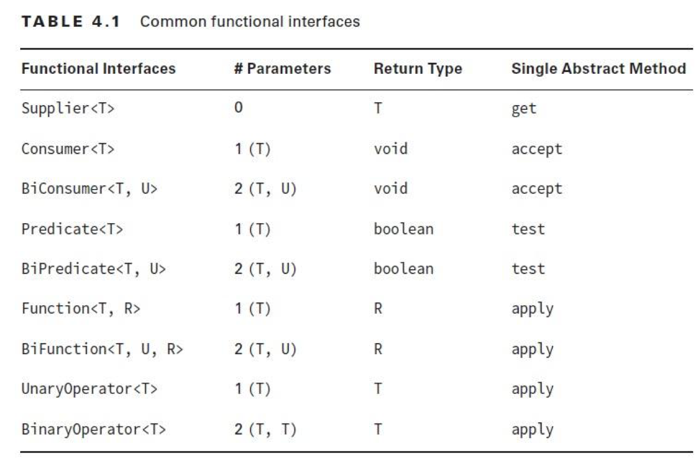

Примеры и теория взяты из статей

- [Введение в лямбда-выражения](https://metanit.com/java/tutorial/9.1.php)
- [Лямбды как параметры и результаты методов](https://metanit.com/java/tutorial/9.2.php)
- [Встроенные функциональные интерфейсы](https://metanit.com/java/tutorial/9.3.php)

