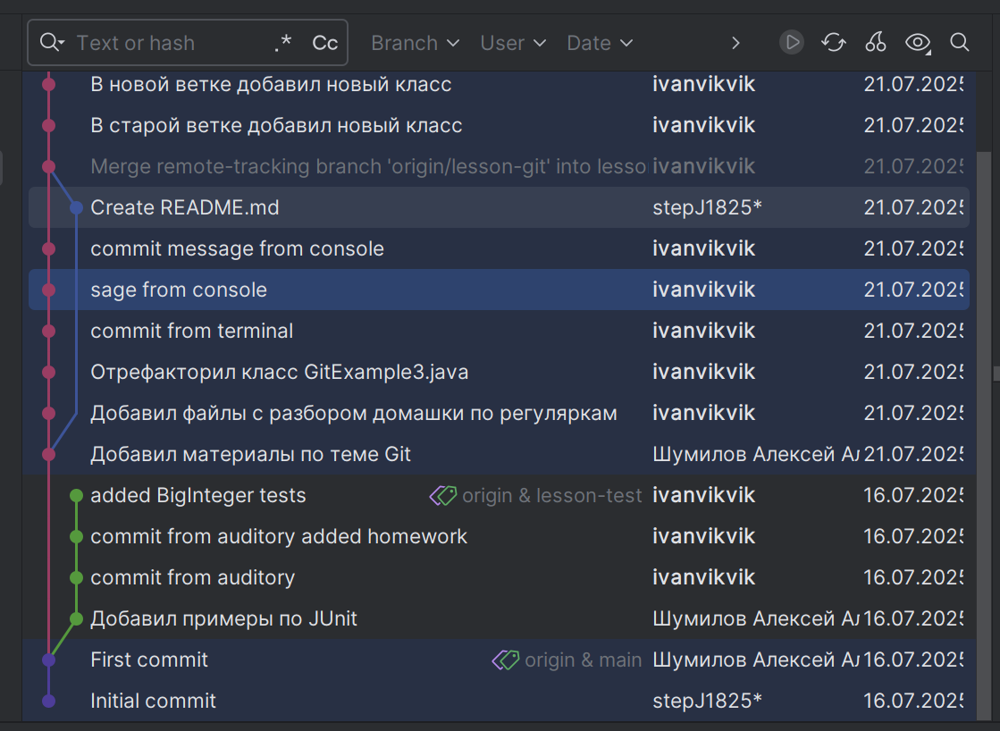
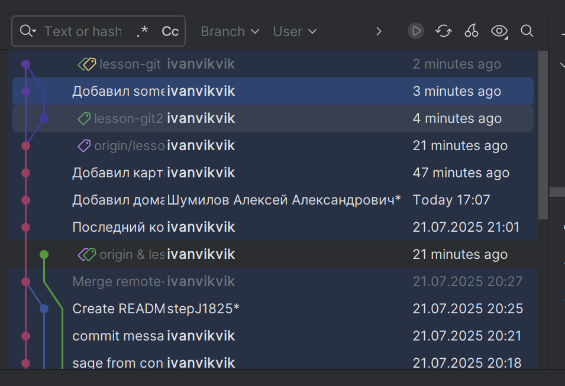

## Основное домашнее задание для сдачи
1. Создать новый пустой каталог и добавить в него пустой текстовый файл (либо это может быть проект
   на Java - Ваше Д/З)
2. Проинициализировать локальный репозиторий командой git init
3. Создать новый удалённый репозиторий.
4. Связать созданный локальный репозиторий с удалённым.
5. Загрузить файл из локального репозитория в удалённый командами git commit и git push (или сделать
   тоже самое через IDEA)
6. Смоделировать реальную разработку с созданием разных веток по методологии GITFLOW.
7. Проверить выполнение запуском команды gitk в командной строке, находясь в корне проекта
8. Приложить скриншот из IDEA (или из gitk) в файл README.md

